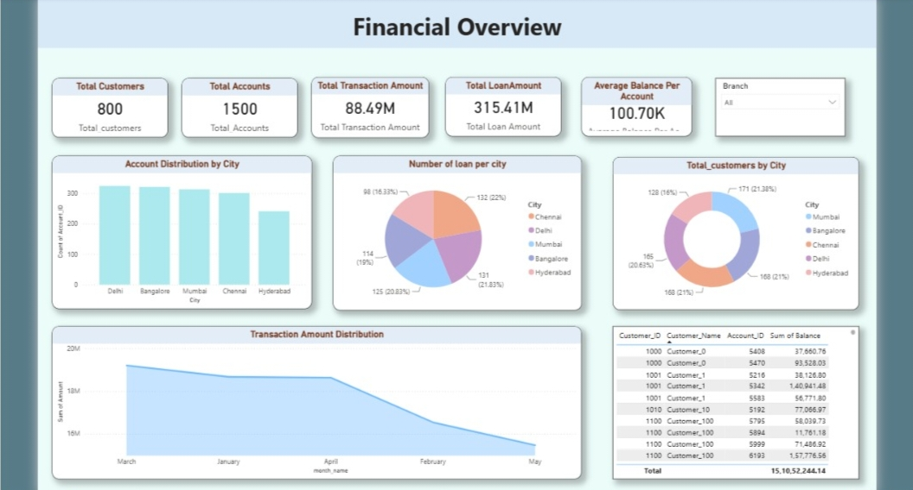
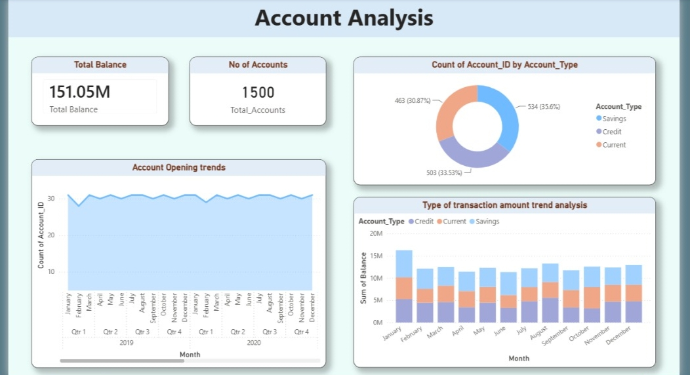
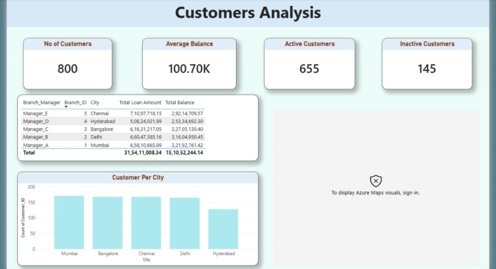
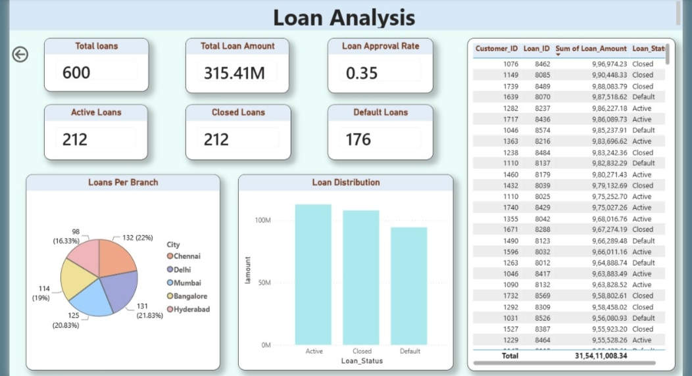
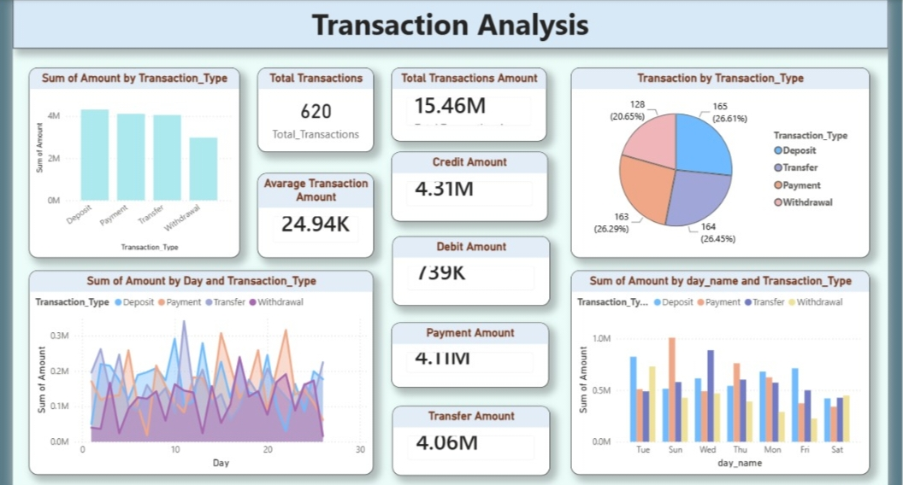

# Banking Financial Intelligence Dashboard

## Project Title
Banking Financial Intelligence Dashboard using Power BI & SQL

## Brief One Line Summary
An interactive multi-page Power BI dashboard analyzing banking data across accounts, customers, loans, and transactions to deliver actionable financial intelligence.

---

## Table of Contents

- [Overview](#overview)
- [Problem Statement](#problem-statement)
- [Dataset](#dataset)
- [Tools and Technologies](#tools-and-technologies)
- [Methods](#methods)
- [Key Insights](#key-insights)
- [Dashboard / Model / Output](#dashboard--model--output)
- [How to Run This Project?](#how-to-run-this-project)
- [Results & Conclusion](#results--conclusion)
- [Future Work](#future-work)
- [Author & Contact](#author--contact)

---

## Overview

This project delivers a comprehensive banking analytics solution built on structured SQL data and visualized through Power BI. It covers five core banking dimensions — financial overview, account management, customer behavior, loan portfolio, and transaction monitoring — enabling branch managers and executives to make data-driven decisions.

The report consists of five interactive pages:

1. Financial Overview
2. Account Analysis
3. Customers Analysis
4. Loan Analysis
5. Transaction Analysis

---

## Problem Statement

Banking institutions manage vast amounts of financial data across customers, accounts, loans, and transactions, yet often lack a unified view to identify risks and opportunities in real time.

The objective of this project is to:

- Provide a single-pane financial overview across all branches.
- Monitor account distribution, balance trends, and account types.
- Analyze customer activity, segmentation, and city-wise distribution.
- Track loan portfolio health including active, closed, and defaulted loans.
- Understand transaction patterns by type, day, and amount.

---

## Dataset

The dataset consists of multiple interrelated banking tables:

### Fact Tables
- Transactions
- Loans

### Dimension Tables
- Customers
- Accounts
- Branches

### Key Fields
- Account Balance
- Transaction Amount & Type
- Loan Amount & Status
- Customer Status (Active / Inactive)
- Branch & City Information
- Date & Time Dimensions

---

## Tools and Technologies

### Database
- SQL (Data extraction & querying)

### Data Visualization
- Power BI Desktop
- Power BI Service

### Data Modeling
- Star / Snowflake Schema

### Querying & Data Preparation
- SQL Queries
- Data Cleaning & Transformation

### Languages
- SQL
- DAX (Data Analysis Expressions)

---

## Methods

### 1. Data Extraction
- Extracted banking data from structured CSV files (Accounts, Customers, Branches, Loans, Transactions).
- Loaded and transformed data into Power BI using Power Query.

### 2. Data Cleaning
- Removed duplicate records.
- Handled null/missing values across all tables.
- Standardized date formats and categorical fields.

### 3. Data Modeling
Implemented a relational schema where:

Customers → Accounts → Transactions

Customers → Loans

Branches → Customers

This structure ensures referential integrity and efficient filtering across all report pages.

### 4. DAX Calculations
Created measures for:

- Total Balance
- Total Loan Amount
- Loan Approval Rate
- Average Balance Per Account
- Credit / Debit / Payment / Transfer Amounts
- Active vs Inactive Customer Counts
- Account Opening Trends

### 5. Dashboard Development
Built interactive dashboards using:

- KPI Cards
- Donut Charts
- Stacked Bar Charts
- Line & Area Charts
- Data Tables
- Branch-level Slicers
- Drill-through Analysis

---

## Key Insights

### Financial Insights
- Total loan amount stands at **315.41M** across 600 loans.
- Total account balance is **151.05M** across 1,500 accounts.
- Total transaction volume is **88.49M** across 620 transactions.

### Account Insights
- Account types are nearly evenly split: Savings (35.6%), Current (33.53%), Credit (30.87%).
- Account opening trends remain stable across 2019–2020 (~28–30 accounts per month).
- Credit account balances peak in January–February, stabilizing mid-year.

### Customer Insights
- 800 total customers with 655 active and 145 inactive.
- Average balance per account: **100.70K**.
- Mumbai, Bangalore, Chennai, and Delhi each hold ~160–170 customers.
- Chennai branch leads in total loan amount (₹7.1Cr), followed by Bangalore (₹6.16Cr).

### Loan Insights
- 212 Active, 212 Closed, and 176 Default loans out of 600 total.
- Loan approval rate: **0.35**.
- Delhi leads in loan count (22%), followed by Bangalore (21.83%).
- Default loans represent a significant portion — requiring targeted risk intervention.

### Transaction Insights
- 620 transactions with average transaction amount of **24.94K**.
- Transaction types are evenly distributed: Deposit (26.61%), Transfer (26.45%), Payment (26.29%), Withdrawal (20.65%).
- Transaction volumes peak mid-week (Wednesday, Thursday) and dip on weekends.

---

## Dashboard / Model / Output

### Page 1: Financial Overview
Key KPIs and cross-branch performance summary.

**Visuals Included**
- Total Customers, Accounts, Transaction Amount, Loan Amount, Average Balance
- Account Distribution by City
- Number of Loans per City
- Total Customers by City
- Transaction Amount Distribution (Monthly)
- Customer-Account Balance Table



---

### Page 2: Account Analysis
Account opening trends and balance behavior by account type.

**Visuals Included**
- Total Balance (151.05M)
- Number of Accounts (1,500)
- Account Type Distribution (Donut Chart)
- Account Opening Trends (2019–2020)
- Transaction Amount Trend by Account Type



---

### Page 3: Customers Analysis
Customer demographics, activity status, and branch-wise performance.

**Visuals Included**
- Total Customers, Average Balance, Active & Inactive Counts
- Branch Manager Summary Table (Loan Amount & Balance)
- Customers Per City (Bar Chart)
- Geographic Distribution (Azure Maps)



---

### Page 4: Loan Analysis
Loan portfolio health, distribution, and risk assessment.

**Visuals Included**
- Total Loans, Loan Amount, Approval Rate
- Active, Closed, and Default Loan Counts
- Loans Per Branch (Pie Chart)
- Loan Distribution by Status (Bar Chart)
- Customer-Level Loan Detail Table



---

### Page 5: Transaction Analysis
Transaction volume, type breakdown, and daily/weekly patterns.

**Visuals Included**
- Sum of Amount by Transaction Type
- Total Transactions & Average Amount
- Credit, Debit, Payment, Transfer Amounts
- Transaction by Type (Pie Chart)
- Daily Transaction Trends (Line Chart)
- Day-wise Transaction Pattern (Bar Chart)



---

## How to Run This Project?

### Prerequisites
- Power BI Desktop
- SQL Database (or use provided CSV files)

### Steps

1. Clone the repository.

```bash
git clone https://github.com/Yog-baviskar/Banking-Financial-Intelligence-Dashboard
```

2. Open the SQL scripts and create the required tables (Accounts, Customers, Branches, Loans, Transactions).

3. Import the CSV files into your SQL database or load them directly into Power BI.

4. Open the `Banking_Analysis.pbix` file in Power BI Desktop.

5. Update the data source connection details if using a SQL database.

6. Refresh the dataset.

7. Explore all five interactive dashboard pages.

---

## Results & Conclusion

The dashboard successfully transforms raw banking data into actionable financial intelligence across five analytical dimensions.

### Benefits
- Centralized view of all banking KPIs in one platform
- Faster identification of loan default risks
- Improved branch-level performance monitoring
- Better understanding of customer activity and retention
- Real-time transaction pattern detection

The solution provides banking stakeholders with a scalable, interactive reporting system to monitor financial health, customer behavior, and operational efficiency.

---

## Future Work

- Loan Default Prediction using Machine Learning
- Customer Churn Analysis
- Customer Lifetime Value (CLV) Modeling
- Automated Data Refresh via Power BI Service
- Real-Time Transaction Monitoring
- Integration with AWS Data Pipeline (S3, RDS, Redshift)
- Advanced Customer Segmentation using Clustering

---

## Author & Contact

### Yogesh Baviskar

**Role:** Data Analyst

### Skills
- SQL
- Power BI
- Python
- Advanced Excel
- AWS (S3, RDS, Redshift, Athena)
- Data Modeling
- Business Analytics

### GitHub
https://github.com/Yog-baviskar

### LinkedIn
https://www.linkedin.com/in/yogesh-baviskar-a25141321

---
⭐ If you found this project useful, please consider giving it a star on GitHub.
